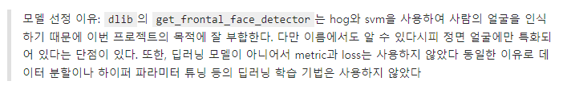
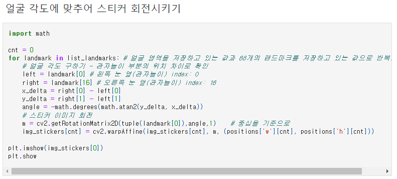

#### 코더 회고
배운 점
- OpenCV 라이브러에 대해서 전체적으로 알 수 있었다

아쉬운 점, 어려웠던 점
- 얼굴 각도에 맞추어 스티커 이미지를 적절하게 회전 시키는 기능을 추가하고 싶었는데 시간 부족으로 구현하지 못했다. 

느낀 점
- 실제 생활에 적용될 수 있다고 느껴져 평소보다 더 즐겁게 할 수 있었다

##### 결과 비교
어두운 배경에서는 얼굴이 아닌데도 인식하는 경우가 있었다  
세일러문, 짱구와 같이 현실세계와 동떨어지는 얼굴은 인식하지 못했지만 실제와 비슷하게 생긴 얼굴 그림은 인식했다  
여러명일 경우에도 잘 인식했지만 너무 멀어 해상도가 떨어지는 경우에는 인식하지 못했다  

---
### 리뷰어
🔑 **PRT(Peer Review Template)**

- [Yes]  **1. 주어진 문제를 해결하는 완성된 코드가 제출되었나요? (완성도)**
    - 문제에서 요구하는 최종 결과물이 첨부되었는지 확인
    - 문제를 해결하는 완성된 코드란 프로젝트 루브릭 3개 중 2개, 
    퀘스트 문제 요구조건 등을 지칭
        - 해당 조건을 만족하는 부분의 코드 및 결과물을 캡쳐하여 사진으로 첨부

리뷰어 : 문제에서 요구하는 최종 결과물이 다양한 형태로 (애니메이션, 선글라스, 각도가 있는 얼굴) 테스트되고, 정확한 위치에 수염이 달렸습니다

완성된 이미지 파일은 results 폴더에 첨부 되어 있습니다. 

- [Yes]  **2. 프로젝트에서 핵심적인 부분에 대한 설명이 주석(닥스트링) 및 마크다운 형태로 잘 기록되어있나요? (설명)**
    - [YES]  모델 선정 이유
    - [대상아님]  Metrics 선정 이유
    - [대상아님]  Loss 선정 이유
  
  모델 선정 이유에 대해 고민하고, 작성해 두셨습니다. 저는 생각도 못했는데 깊게 공부하고 있다는 것을 알 수 있었습니다

- [Yes]  **3. 체크리스트에 해당하는 항목들을 모두 수행하였나요? (문제 해결)**
    - [Yes]  데이터를 분할하여 프로젝트를 진행했나요? (train, validation, test 데이터로 구분)
    - [대상아님]  하이퍼파라미터를 변경해가며 여러 시도를 했나요? (learning rate, dropout rate, unit, batch size, epoch 등)
    - [Yes]  각 실험을 시각화하여 비교하였나요?
    - [Yes]  모든 실험 결과가 기록되었나요?

리뷰어 : 다양한 대상에 실험을 하며 결과물 이미지를 기록하였고, 마지막에 open-cv 문서를 보고 얼굴의 각도가 다를 때 어색하게 붙은 수염 이미지의 각도를 변경하려는 시도도 하였음

- [Yes]  **4. 프로젝트에 대한 회고가 상세히 기록 되어 있나요? (회고, 정리)**
    - [Yes]  배운 점
    - [Yes]  아쉬운 점
    - [Yes]  느낀 점
    - [Yes]  어려웠던 점

리뷰어 : 회고는 파일 위에 적혀 있습니다