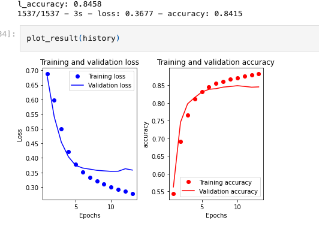
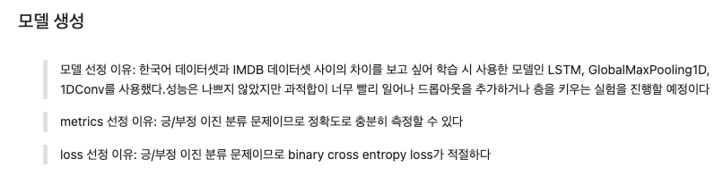
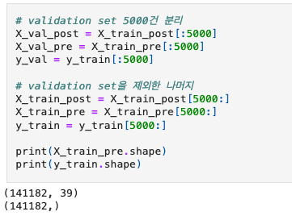
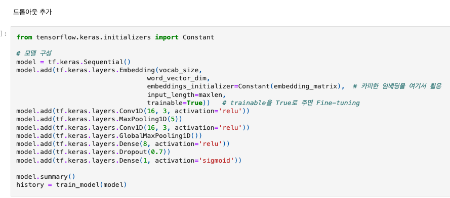
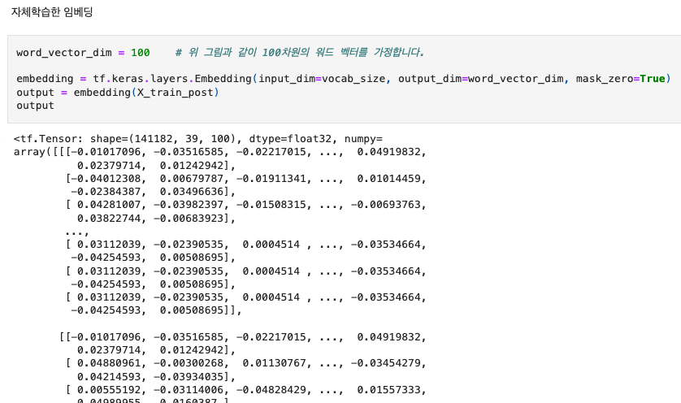

#### 코더 회고
배운 점
- 텍스트 데이터 처리를 전체적으로 배울 수 있었고, 다양한 임베딩 사용법에 대해 알 수 있었다. 

아쉬운 점, 어려웠던 점
- 더 다양하게 시험하고 정확도를 넘기고 싶었는데 그러지 못해 아쉽다

느낀 점
- 결과를 비교하고 성능을 향상시키기 위해 여러번의 실험을 거치는 작업이 재미있었다 

---
### 리뷰어
🔑 **PRT(Peer Review Template)**

- [o]  **1. 주어진 문제를 해결하는 완성된 코드가 제출되었나요? (완성도)**
    - 문제에서 요구하는 최종 결과물이 첨부되었는지 확인
    - 문제를 해결하는 완성된 코드란 프로젝트 루브릭 3개 중 2개, 
    퀘스트 문제 요구조건 등을 지칭
        - 해당 조건을 만족하는 부분의 코드 및 결과물을 캡쳐하여 사진으로 첨부

1) LSTM
2) GlobalMaxPooling1D
3) 1D CNN
- 3가지 모델로 실험을 진행하셨습니다.

3개의 모델을 이용한 실험을 하였고 이에 대한 그래프를 잘 출력하였습니다

- [o]  **2. 프로젝트에서 핵심적인 부분에 대한 설명이 주석(닥스트링) 및 마크다운 형태로 잘 기록되어있나요? (설명)**
    - [o]  모델 선정 이유
    - [o]  Metrics 선정 이유
    - [o]  Loss 선정 이유

- **추가 적으로 제가 생각하기에는 dataset의 label이 거의 1:1 비율이라 acc로 측정이 가능한 것 같습니다!**

- [o]  **3. 체크리스트에 해당하는 항목들을 모두 수행하였나요? (문제 해결)**
    - [o]  데이터를 분할하여 프로젝트를 진행했나요? (train, validation, test 데이터로 구분)
    
    - [o]  하이퍼파라미터를 변경해가며 여러 시도를 했나요? (learning rate, dropout rate, unit, batch size, epoch 등)
    
    - 드롭아웃을 추가하여 실험을 진행하셨습니다.

    - [o]  각 실험을 시각화하여 비교하였나요?
    

    - [o]  모든 실험 결과가 기록되었나요?
    
    - 자체학습한 임베딩을 확인하였습니다. 

- **test_data에 대한 성능 검증이 들어가지 않았는데 이에 대한 내용이 추가 되면 좋을 것 같습니다**

- []  **4. 프로젝트에 대한 회고가 상세히 기록 되어 있나요? (회고, 정리)**
    - []  배운 점
    - []  아쉬운 점
    - []  느낀 점
    - []  어려웠던 점
